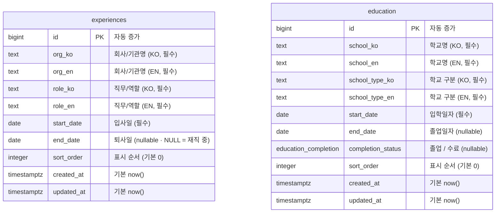

# 데이터베이스 ERD

Erin Lee 포트폴리오의 **경력(Experience)** / **학력(Education)** 데이터 스키마.

- **DB**: Supabase (PostgreSQL)
- **ORM**: Drizzle (`drizzle/schema.ts`가 단일 진실 공급원 / source of truth)
- **i18n**: 사이트가 KO/EN 2개 로케일 고정이므로, 번역 테이블 대신 **per-locale 컬럼**(`*_ko`, `*_en`)으로 관리. 단, 통제된 값(`completion_status` 졸업/수료)은 enum 코드로 저장하고 KO/EN 라벨은 프런트에서 매핑
- 두 테이블은 서로 관계(FK)가 없는 독립 엔티티

## ERD

## 테이블 상세

### `experiences` — 경력

| 컬럼 | 타입 | NULL | 설명 |
|------|------|------|------|
| `id` | `bigserial` | NO | PK |
| `org_ko` / `org_en` | `text` | NO | 회사/기관명 (로케일별) |
| `role_ko` / `role_en` | `text` | NO | 직무/역할 (로케일별) |
| `start_date` | `date` | NO | **입사일** (년-월-일) |
| `end_date` | `date` | YES | **퇴사일**. `NULL`이면 현재 재직 중("현재"/"Present"로 렌더) |
| `sort_order` | `integer` | NO | 표시 순서. 기본 0. 보통 `start_date DESC`로도 정렬 가능 |
| `created_at` / `updated_at` | `timestamptz` | NO | 기본 `now()` |

### `education` — 학력

| 컬럼 | 타입 | NULL | 설명 |
|------|------|------|------|
| `id` | `bigserial` | NO | PK |
| `school_ko` / `school_en` | `text` | NO | 학교명 (로케일별) |
| `school_type_ko` / `school_type_en` | `text` | NO | 학교 구분 (예: 대학교/대학원 — 로케일별) |
| `start_date` | `date` | NO | **입학일자** (년-월-일) |
| `end_date` | `date` | YES | **졸업일자** (재학 중이면 NULL) |
| `completion_status` | `education_completion` (enum) | YES | **졸업/수료** — `graduated`(졸업) / `completed`(수료) |
| `sort_order` | `integer` | NO | 표시 순서. 기본 0 |
| `created_at` / `updated_at` | `timestamptz` | NO | 기본 `now()` |

## 보안 (RLS)

두 테이블 모두 **RLS 활성화 + 공개 SELECT 정책**(`using (true)`)을 둔다.

- 앱은 서버에서 Drizzle(직접 Postgres 연결, `postgres` 롤)로 읽으므로 RLS를 우회 — 정상 동작.
- 공개 SELECT 정책은 혹시 `@supabase/supabase-js`의 publishable(anon) 키로 읽을 때를 위한 안전장치.
- INSERT/UPDATE/DELETE 정책은 없음 → anon 키로는 쓰기 불가 (관리 작업은 서버/secret 키 또는 대시보드에서).

## 변경 절차

1. `drizzle/schema.ts` 수정 (source of truth)
2. 이 문서(`docs/db/erd.md`)의 ERD/표를 함께 갱신
3. DB 반영: `npm run db:push` (개발) 또는 `npm run db:generate` → `npm run db:migrate`
4. 신규 테이블은 RLS 활성화 + 정책 추가 필요 (Drizzle push는 RLS를 자동 생성하지 않음)
